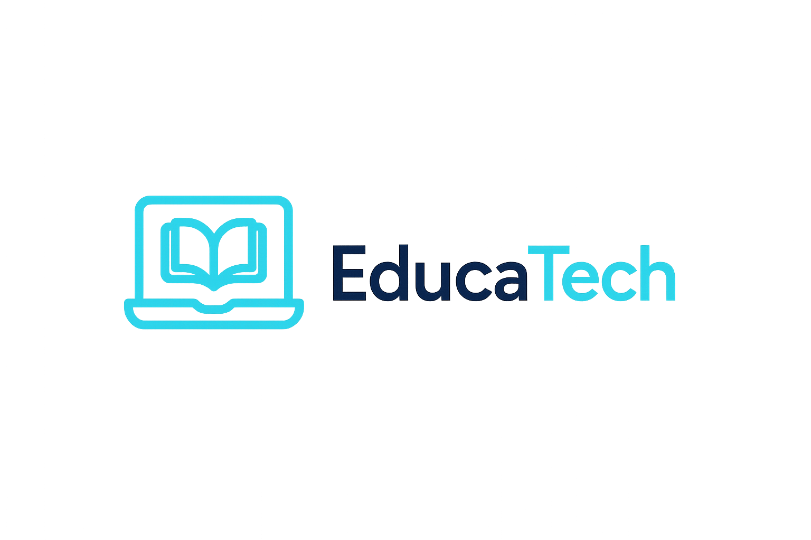

# 🌐 EducaTech – Plataforma de Aprendizado Interativo em Tecnologia



Landing Page oficial do projeto fictício **EducaTech**, desenvolvida como parte do projeto acadêmico de Análise e Desenvolvimento de Sistemas, Universidade Presbiteriana Mackenzie, disciplina Projetos Empreendedores.  
O objetivo é a montagem de um projeto e a construção de landing page, com o intuito de ver na prática suas principais funções, além de exercitar as competências necessárias para captação de usuários e conversão para clientes.
O link apresentado como CTA (call to action) tem apenas o intuito de captar número de cliques, afim de verificar eficácia do negócio em potencial.

---

## 🚀 Sobre o Projeto

A **EducaTech** é uma plataforma de aprendizado digital voltada ao ensino de tecnologia.  
Ela oferece cursos acessíveis, trilhas personalizadas e uma comunidade ativa de mentoria.

Esta landing page foi desenvolvida para representar visualmente o projeto, apresentando sua proposta, valores e canais de contato.

---

## 🧱 Estrutura do Projeto

```bash
educatech-landing/
│
├── index.html          # Página principal
├── style.css           # Estilos e responsividade
└── assets/
    ├── logo.png        # Logotipo do projeto
    ├── banner.jpg      # (opcional) imagem de cabeçalho
    └── icons/          # (opcional) ícones adicionais

---

## 🖥️ Tecnologias Utilizadas

- **HTML5** – estrutura semântica e acessível  
- **CSS3 (Flexbox + Grid)** – layout responsivo  
- **Material Design Icons (Google)** – ícones modernos e leves  
- **Google Fonts (Roboto)** – tipografia limpa e padronizada  
- **Unsplash** – imagens ilustrativas gratuitas  

---

## 📸 Imagens Utilizadas (Licença Gratuita - Unsplash)

- Banner principal: [Tech Collaboration](https://unsplash.com/photos/47ba0277781c)  
- Seção “Sobre”: [Online Learning](https://unsplash.com/photos/6a6a0d7b1e84)  
- Seção “Comunidade”: [Team Learning](https://unsplash.com/photos/d14cc237f11d)  

---

## 🎨 Características

- Design responsivo (desktop, tablet e mobile)  
- Layout baseado em colunas (CSS Grid)  
- Ícones do Material Design integrados  
- Estrutura modular e fácil de manter  
- 100% gratuito e pronto para publicação  

---

## 🧭 Call to Action (CTA)

> **“Quero aprender tecnologia”**

Essa chamada de ação capta o clique e a envia para o GA (Google analytics), onde este é contabilizado para avaliação posterior de interesse.
